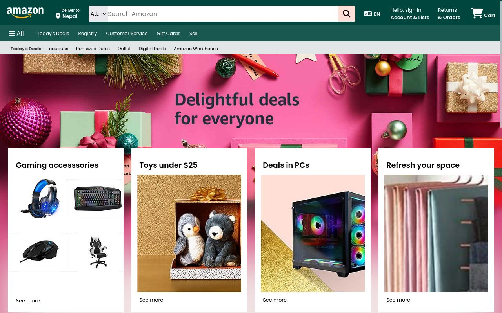

# Amazon Clone

A simple HTML and CSS implementation of an Amazon clone.

## Table of Contents

- [Features](#features)
- [Screenshots](#screenshots)
- [Getting Started](#getting-started)
- [Usage](#usage)
- [Contributing](#contributing)


## Features

- Basic layout resembling the Amazon website.
- Implemented using only HTML and CSS.

## Screenshots

Screenshots of my project to give users a quick preview.




## Getting Started

These instructions will help you set up a copy of the project on your local machine.

1. Clone the repository:

   ```bash
   git clone https://github.com/suraj-tech-in/amazon-clone.git

## Usage

To use the Amazon clone, follow these steps:

1. Open the `index.html` file in your preferred web browser.
2. Use the Amazon clone.

Feel free to customize and extend the project according to your needs!

## Contributing

As i have not used javascript or made it completely responsive, if you would like to contribute to the project, please follow these steps:

 1.   Fork the repository.
 2.   Create a new branch for your feature: `git checkout -b feature-name`
 3.   Commit your changes: `git commit -m 'Add new feature'`
 4.   Push to the branch: `git push origin feature-name`
 5.   Submit a pull request.
