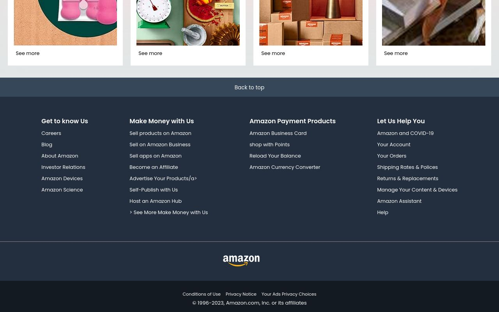

# Amazon Clone

A simple HTML and CSS implementation of an Amazon clone.

## Table of Contents

- [Features](#features)
- [Screenshots](#screenshots)
- [Getting Started](#getting-started)
- [Usage](#usage)
- [Contributing](#contributing)
- [License](#license)


## Features

- Basic layout resembling the Amazon website.
- Implemented using only HTML and CSS.

## Screenshots

Include screenshots or GIFs of your project to give users a quick preview.




## Getting Started

These instructions will help you set up a copy of the project on your local machine.

1. Clone the repository:

   ```bash
   git clone https://github.com/your-username/amazon-clone.git
